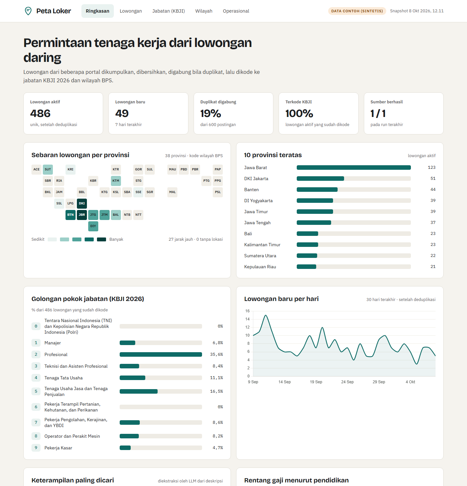

# Peta Loker

> **Disclaimer**
> This is a personal portfolio project built for learning and demonstration only.
> - It is **not affiliated with, endorsed by, or connected to** any job platform, company,
>   or government agency mentioned in this repository.
> - Figures and occupation codes (KBJI/KBLI) are produced automatically, partly by an LLM,
>   and **may be wrong**. They are **not official statistics** and must not be used for
>   decisions or policy.
> - Data is collected from publicly accessible pages that permit crawling (robots.txt), at a
>   low request rate, for non-commercial use. Only a limited set of recent postings is shown,
>   with company identities pseudonymised, contact details removed, and descriptions
>   truncated. Full raw content is not redistributed. See
>   [docs/terms_of_service.md](docs/terms_of_service.md) for each source's terms.
> - All trademarks belong to their respective owners.
> - If you own content shown here and want it removed, please [open an issue](../../issues).

**Peta Loker** turns scattered Indonesian online job ads into a clean, de-duplicated dataset coded to
KBJI 2026 occupations and BPS regions, and shows it in a public dashboard. It's built to demonstrate
end-to-end data engineering, LLM-based classification with measured accuracy, and responsible handling of
scraped data.

**Live snapshot:** [peta-loker.vercel.app](https://peta-loker.vercel.app) (8 Oct 2026) · **Try it locally:** `make demo` (no accounts needed)



## The problem

- **Scattered and inconsistent.** Every portal has its own format; the same city or salary is written ten
  different ways, and key fields (salary, education, experience) are often missing or buried in text.
- **Duplicated.** One job is posted on several portals and reposted over time, so naive counts overstate
  demand.
- **Not coded to official standards.** Job titles aren't mapped to KBJI (Indonesia's occupation
  classification) or employers to KBLI, so the data can't be compared with official statistics.

## What it does

```
5 job portals ──► scrapers ──► raw pages (TOS) ──► normalise ──► dedup ──► LLM coding ──► quality gate ──► dashboard
 + CSV import     one base      replayable          salary,        exact,     KBJI 2026      blocks          static,
                  class         without refetch     education,     repost,    4 → 6 digit,   publishing      masked,
                                                    BPS region     fuzzy      skills, KBLI   on failure      Vercel
```

| Step | How |
|---|---|
| Collect | One `JobSource` base class owns robots.txt checks, 2–5 s delays, page caps (the newest 10 listing pages per source), masking and the 60-day window; each portal only says where its jobs are and how to read one |
| Normalise | Salary → monthly IDR, lowest education level, minimum years of experience, location → BPS regency code |
| Dedup | Exact id, identical content, then fuzzy title + description match within company and province; stable vacancy ids |
| Code | Seed 2.0 Pro picks the 4-digit unit group from all 447, then the 6-digit jabatan within it; every answer is validated against the official table |
| Publish | A quality gate and a deploy check guarantee no contact details and no company names reach the public site |

Details: [docs/architecture.md](docs/architecture.md) · Product requirements: [docs/PRD.md](docs/PRD.md)

## Sources

| Source | Coverage | How jobs are read |
|---|---|---|
| Glints | Tech and white-collar | schema.org `JobPosting` JSON-LD, discovered via sitemaps |
| Dealls | Startups, young professionals | JSON-LD, discovered via the public job-search API |
| Loker.id | General, national, all sectors | JSON-LD plus job level and function from the HTML |
| Kalibrr | General white-collar | Full records from the job-search endpoint (15 per request) |
| KitaLulus | Blue-collar and frontline | Headless browser on public pages (its data API is disallowed by robots.txt and not used) |
| CSV / XLSX | Demo data, backfill | `FileSource`, same pipeline |

What each source's robots.txt and terms of service say, quoted, is in
[docs/terms_of_service.md](docs/terms_of_service.md). JobStreet, Karir.com, LinkedIn and Indeed are not
used; the reasons are listed there.

## Results

Full numbers, regenerated by `make evaluate`: [docs/results.md](docs/results.md). The KBJI and dedup checks were
labelled by a second LLM (Claude), not by people, so they measure agreement between two models; most
disagreements are sales jobs, where KBJI's sales codes overlap.

| Metric | Value |
|---|---|
| Postings collected (latest 10 listing pages per source, last 60 days) | 804 from 5 sources (8 Oct 2026) |
| Unique vacancies after dedup | 737 (67 duplicates merged, 46 vacancies seen on 2+ sources) |
| Dedup precision, 100 checked pairs | 0.75 (was 0.12 before the branch-name fix; threshold tuned on these pairs) |
| Location mapped to a BPS region / regency | 99.6% / 77.1% |
| Salary / education / experience parsed | 48.6% / 71.4% / 63.3% |
| KBJI agreement with an independent LLM reviewer, 1 / 4 / 6 digits (198 jobs, blind) | 73.7% / 54.5% / 42.3% |
| Vacancies coded to KBJI 6-digit / 4-digit only / flagged for review | 728 / 9 / 59 (8.0%) |
| LLM cost per 1,000 vacancies (Seed 2.0 Pro, KBJI + KBLI) | about US$1.3 |

## Quickstart

Requirements: [uv](https://docs.astral.sh/uv/) and GNU make. Python 3.13 is installed by uv.

```bash
make install          # Python deps + Playwright Chromium
make demo             # whole pipeline on synthetic data: no network, no accounts (~1 s)
make dashboard-serve  # open http://localhost:8000
```

`make demo` codes the synthetic jobs with hand-assigned labels instead of calling the LLM, so it's free
and deterministic; `uv run python scripts/demo.py --llm` uses the real coder.

Real collection:

```bash
cp .env.example .env  # HMAC_SECRET, and optionally TOS_* (raw store) and ARK_* (LLM)
make db-init          # schema + KBJI 2026 + BPS regions
make run SOURCE=all   # collect (falls back to a local raw store without TOS credentials)
make normalise dedup enrich quality dashboard
make deploy           # refuses unless the data is public and clean
```

Daily collection: schedule `make daily` (collect → normalise → dedup → quality gate, logged to
`data/logs/`) once a day — with cron on Linux/macOS (`0 6 * * * cd /path/to/job_market && make daily`), or
on Windows with Task Scheduler:

```powershell
schtasks /Create /SC DAILY /ST 06:00 /TN PetaLokerDaily /TR "bash -lc 'cd ~/job_market && make daily'"
```

`make help` lists every target. Tests: `make test` (no network or keys needed). Lint: `make lint`.

## Design decisions

- **robots.txt decides which sources and pages are used.** That's why JobStreet isn't here, why Glints is
  read from sitemaps instead of its search page, and why KitaLulus's data API is never called — not even by its own pages' scripts, which the headless browser stops.
- **Structured data first.** Most portals publish schema.org `JobPosting` for search engines; one generic
  extractor covers three sites, and HTML scraping is a small hook, not the default.
- **Raw pages are kept** (BytePlus TOS, or a local folder), so a parser fix is a `make reparse`, not a
  re-crawl.
- **Portable SQL on SQLite.** Deterministic TEXT keys, ISO timestamps with offsets, `ON CONFLICT` upserts,
  all SQL in one module — PostgreSQL is a connection change.
- **Two-step LLM coding.** 2,380 job titles don't fit in a prompt; 447 unit groups do. The second step only
  sees one unit's children. Answers are validated, versioned by prompt, and logged with token counts.
- **Masking happens at ingestion**, not at publishing: contact details never reach the clean tables.
  Publishing adds HMAC company pseudonyms (a plain hash of a company name could be reversed by guessing),
  hashed vacancy ids and truncated descriptions.
- **Nothing is imputed.** A salary that isn't shown stays empty; an ambiguous city is coded to its province.
- **Deploy from the laptop with the Vercel CLI**, so real data never enters git, behind a check that scans
  every published value for contact details.
- **Tile map instead of GeoJSON.** The province map is a tile cartogram: no boundary-data licensing, and
  small provinces stay visible.

## Repository layout

```
config/sources.yaml   sources, collection rules, dedup thresholds, LLM settings
core/                 base class, HTTP client, raw store, db (all SQL), masking, normalise, dedup, LLM
sources/              JSON-LD, API, browser and file strategies + one module per portal
scripts/              run, reparse, normalise, dedup, enrich, quality_check, generate_dashboard_data,
                      deploy_check, evaluate, export, demo, build_kbji, build_regions
db/schema.sql         schema (portable SQL), with the reasoning in comments
reference/            KBJI 2026, BPS regions, region aliases, KBLI sections
dashboard/            static site (Tailwind, Chart.js, plain JS) + vercel.json
tests/                pytest, synthetic fixtures, no network
docs/                 PRD, architecture, results, terms of service, screenshots
```

## Licence

Code: MIT. Reference data is derived from public BPS publications (KBJI 2026, BPS region codes, KBLI 2020).
Collected job data is not part of this repository.
