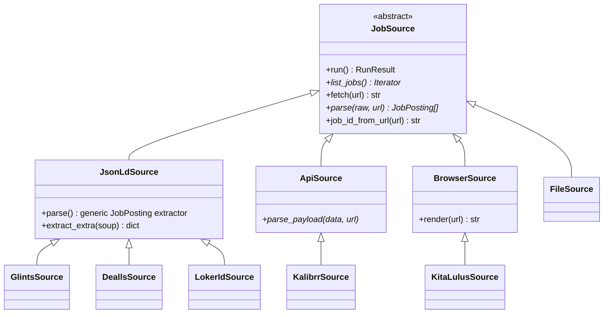
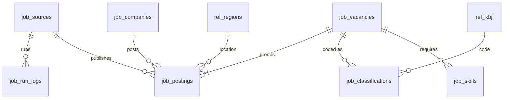
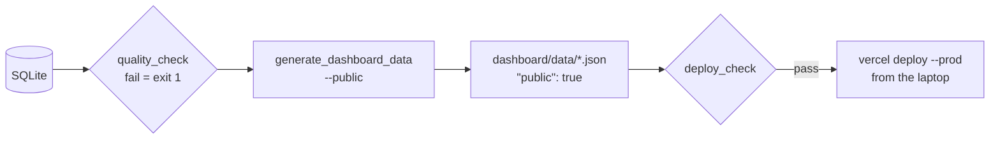

# Architecture

## Data flow

```mermaid
flowchart LR
    subgraph S[Sources]
        G[Glints · Dealls<br/>JSON-LD]
        L[Loker.id<br/>JSON-LD + HTML fields]
        K[Kalibrr<br/>search endpoint JSON]
        KL[KitaLulus<br/>headless browser]
        F[CSV / XLSX<br/>demo · backfill]
    end
    S --> R[Scrapers<br/>JobSource subclasses]
    R --> RAW[(Raw store<br/>BytePlus TOS / local)]
    R --> P[(job_postings<br/>masked)]
    REF[Reference data<br/>KBJI 2026 · BPS regions · KBLI] --> N
    P --> N[Normalise<br/>salary · education · location]
    N --> D[Dedup<br/>exact · repost · fuzzy]
    D --> V[(job_vacancies)]
    V --> E[LLM enrich<br/>Seed 2.0 Lite]
    REF --> E
    E --> C[(classifications<br/>skills · KBLI)]
    C --> Q{Quality gate}
    Q -- pass --> J[Dashboard JSON<br/>--public]
    J --> DC{Deploy check}
    DC -- pass --> W[Static dashboard<br/>Vercel]
    RAW -. make reparse .-> P
```

Every step reads the previous step's output from SQLite, so any step can be re-run on its own
(`make normalise`, `make dedup`, `make enrich`, …). `make pipeline` runs them in order.

## Sources: one base class, four strategies

`JobSource.run()` is a template method that subclasses never override. It owns everything that must be
identical across sources:

1. register the source and open a run log;
2. walk `list_jobs()` (newest first) for at most 10 listing pages (`max_listing_pages`), stopping earlier
   at the detail-page cap or after 30 postings in a row older than 60 days;
3. skip a posting fetched in the last 7 days — seeing it in the listing only refreshes "last seen";
4. `fetch()` through the polite HTTP client (robots.txt, 2–5 s delay, retries, 403/429 → stop);
5. save the raw page, `parse()`, mask contact details, apply the 60-day window, upsert;
6. close the run log with counts and an error type (`blocked`, `layout_changed`, `fetch_failed`, …).

A subclass only supplies where jobs are (`list_jobs`), how to read one (`parse`) and, for a browser or a
file, how to fetch it. A new site that publishes JSON-LD needs about 30 lines.

| Source | Discovery | Parsing | Why this way |
|---|---|---|---|
| Glints | `sitemap_job_id_N.xml`, from 1 (newest); a page = 30 entries | JSON-LD | The explore page with query parameters is disallowed by robots.txt |
| Dealls | Public job-search API, `publishedAt desc`, 20 per page | JSON-LD | The listing page only server-renders 18 jobs; the sitemap has no dates |
| Loker.id | `/cari-lowongan-kerja/page/N`, ~21 per page | JSON-LD + `extract_extra()` | Job level and function appear only in the HTML and help occupation coding |
| Kalibrr | `/kjs/job_board/search`, `sort=Freshness`, 15 per page | Full records from the same JSON | One request = 15 complete postings; no detail pages needed |
| KitaLulus | Rendered listing sorted by `updatedAt` (newest ~31; loading more needs the disallowed API) | JSON-LD + the page's own vacancy record | Its data API host disallows crawlers: the browser aborts the page's own requests to it, so only server-rendered public pages are read |

## Data model

- **job_postings** — one row per listing per source (key `<source>:<job id>`), masked at ingestion, plus
  normalised columns.
- **job_vacancies** — one row per real job (a dedup cluster), with first/last seen and number of sources.
- **job_classifications** — LLM output keyed by (vacancy, model, prompt version): a new prompt adds rows
  instead of overwriting, so results stay comparable.
- **job_companies** — KBLI section coded once per company; the real name never leaves this table.
- **ref_kbji / ref_regions** — KBJI 2026 (3,010 codes) and BPS regions (38 provinces, 514
  regencies/cities), rebuilt from public sources by `make reference`.
- **job_run_logs / llm_usage** — operational history.

The SQL is portable: TEXT keys built in Python (no autoincrement), ISO-8601 timestamps with `+07:00`,
`INSERT … ON CONFLICT … DO UPDATE` for upserts, and all statements in `core/db.py`. Moving to PostgreSQL
changes the connection, not the queries.

## Reference data

- **KBJI 2026** — parsed from the appendix of Peraturan BPS No. 7 Tahun 2026 (PDF from peraturan.go.id).
  Headings are told apart from codes quoted in descriptions by their position at the left margin; wrapped
  titles are detected because each description repeats its title. The result matches the published totals:
  10 major groups, 43 sub-major, 130 minor, 447 unit groups, 2,380 jabatan. (Launch coverage said 449 unit
  groups; the appendix's own summary lists contain two typos, 2613 and 6124, for headings 2619 and 6129.)
- **BPS regions** — BPS's public region lookup (period 2025_1), 38 provinces including the 2022 Papua
  provinces.
- **Region aliases** — a short hand-written list (Jaksel, Solo, Jogja, Tangsel, Kepri, …).

## Normalisation

Pure functions in `core/normalise.py`, always re-derived from the raw text so re-runs are idempotent.

- **Salary** → monthly IDR (min, max). Handles "Rp 5-7 jt", "4.500.000", "3,5 juta", "Rp150rb/hari",
  structured JSON-LD values; day × 22, week × 52/12, hour × 173, year ÷ 12; hidden, foreign-currency or
  implausible values (< Rp500k or > Rp200m a month) become null.
- **Education** → the lowest level mentioned (SD … S3): "D3/S1" means a D3 is enough.
- **Experience** → minimum whole years; "fresh graduate" = 0.
- **Location** → BPS code via aliases, full names ("Kota Bandung"), unique bare names ("Surabaya") and
  English suffixes ("Tangerang City"). A bare name shared by a regency and a city resolves to the province,
  unless the employer's street address names one.

## Dedup

1. **Exact** — `(source, job id)` is the upsert key.
2. **Repost** — identical content hash (title + company + location + start of the masked description).
3. **Fuzzy** — candidates share a normalised company and province and were posted within 30 days; a pair
   matches if titles score ≥ 90 and descriptions ≥ 85 (rapidfuzz `token_set_ratio`), or the titles are
   identical in the same regency.

Union-find turns pairs into clusters. A cluster keeps the oldest vacancy id any member already had, so
classifications survive re-clustering. Thresholds live in `config/sources.yaml`; `scripts/dedup.py --review`
writes a sheet of borderline pairs for checking precision by hand.

## LLM coding

- **Step A**, batches of 10: the full list of 447 unit groups is a fixed prompt prefix (cache-friendly);
  the model returns a 4-digit code, a second choice, a confidence, skills, and a flag if contact details
  survived masking.
- **Step B**, per unit group: only that unit's 6-digit children are offered.
- **KBLI**: one section (A–U) per company, from its name, the industry a source states, and its job titles.

Items carry short references (`j1`, `j2`) instead of real ids. Each answer is validated in code — references
match, codes exist, the 6-digit code sits under its 4-digit parent, confidences are in [0, 1]. A malformed
answer is retried once; a content-filter rejection splits the batch in half until the offending item is
isolated. Confidence below 0.70 marks a vacancy for review. Every call logs tokens and latency.

## Publishing

- The public export shows companies only as `#` + 6 hex characters of an HMAC pseudonym, blanks the
  company's own name out of titles and descriptions, hashes vacancy ids, cuts descriptions to 200
  characters and caps the list at 500 vacancies.
- `deploy_check` refuses unless every file is marked public, the quality gate passed before the data was
  generated, no record carries a name/URL field, and a final scan finds no e-mail, phone number or contact
  link.
- The CLI uploads `dashboard/` directly, so real data never enters git; `vercel.json` sets
  `X-Robots-Tag: noindex`.

## Conventions

- Python 3.13, uv, flat layout; `from __future__ import annotations` everywhere; narrative docstrings.
- Configuration in `config/sources.yaml`, secrets in `.env` (`.env.example` lists them).
- Every timestamp is Jakarta time.
- Tests never touch the network, TOS, the LLM or the real database (`httpx.MockTransport`, in-memory SQLite,
  temp raw store, synthetic fixtures).
